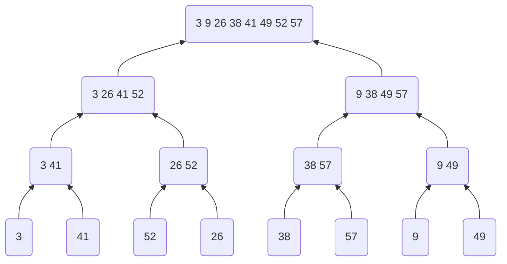

# 2 Getting Started

### 2.1-2

Refer to `InsertionSortNonIncrease()` in [insertion_sort.h](include/ch02/insertion_sort.h).

### 2.1-3

Refer to `LinearSearch()` in [linear_search.h](include/ch02/linear_search.h).

### 2.1-4

Refer to `BinaryAdd()` in [binary_add.h](include/ch02/binary_add.h).

### 2.2-1

$\Theta(n^3)$

### 2.2-2

Refer to `SelectionSortNonIncrease()` in [selection_sort.h](include/ch02/selection_sort.h).

Best-case and worst-case are all $\Theta(n^2)$.

### 2.2-3

It runs $n/2$ times in average-case, and $n$ times in worst-case. They are all $\Theta(n)$.

### 2.2-4

We can rearrange the data to a special pattern, like in good ordered or something else. Then the algorithm may run in best-case.

### 2.3-1

